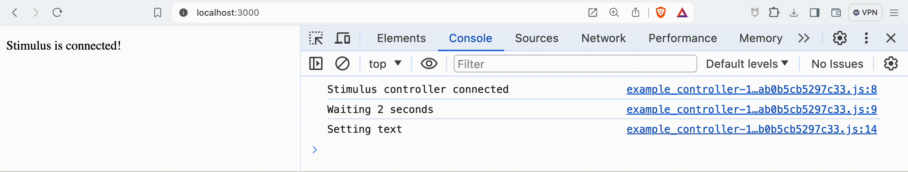
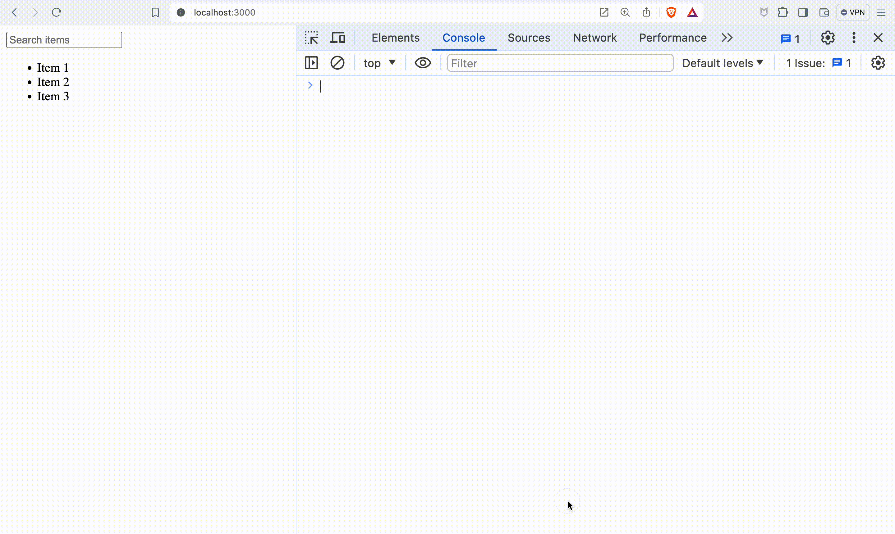
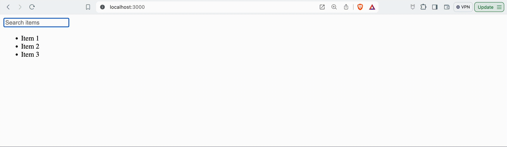

# Object Oriented JavaScript with Stimulus
In our previous lesson, we explored JavaScript fundamentals and how it interacts with the DOM to create dynamic user interfaces. Now, we're ready to take it a step further by introducing Object-Oriented JavaScript and [Stimulus](https://stimulus.hotwired.dev/), a JavaScript framework that seamlessly integrates with your Rails app.

## Bridging the Gap: From JavaScript Basics to Stimulus

### The Evolution of JavaScript
JavaScript has evolved from a simple scripting language to a powerful tool for building complex applications. Understanding Object-Oriented JavaScript principles is crucial for writing maintainable and scalable code. With Object-Oriented JavaScript, we can structure our code into reusable and logical modules, making it easier to manage and extend.

### Introducing Object-Oriented JavaScript
Object-Oriented JavaScript allows us to create and manage objects with properties and methods, enabling more sophisticated and modular programming. We'll start by exploring classes and their role in organizing JavaScript code.

### Classes in JavaScript
Classes are blueprints for creating objects with shared properties and methods. They encapsulate data and behavior, providing a clear and organized structure.

```javascript
class Animal {
  constructor(name) {
    this.name = name;
  }

  speak() {
    console.log(`${this.name} makes a noise.`);
  }
}

const dog = new Animal('Dog');
dog.speak(); // Dog makes a noise.
```

In this example, we define a class Animal with a constructor to initialize the name property and a speak method. We then create an instance of the Animal class and call its speak method.

### ES6 Imports and Exports
Modern JavaScript (ES6) allows us to split our code into modules. We can export functions, objects, or classes from one file and import them into another, promoting code reusability and maintainability.

```javascript
// animal.js
export default class Animal {
  constructor(name) {
    this.name = name;
  }

  speak() {
    console.log(`${this.name} makes a noise.`);
  }
}
```

```javascript
// main.js
import Animal from './animal';

const cat = new Animal('Cat');
cat.speak(); // Cat makes a noise.
```

In `animal.js`, we export the `Animal` class using export default. In `main.js`, we import the `Animal` class and use it to create a new `cat` object.

## Using Stimulus for Structured JavaScript
Stimulus is designed to work seamlessly with server-rendered HTML, providing a way to organize JavaScript behavior around your HTML elements without the need for a complex front-end framework.

### Why Stimulus?
In traditional web development, you might scatter `script` tags throughout your views, leading to disorganized and difficult-to-maintain code. Stimulus offers a structured approach by linking JavaScript controllers directly to your HTML, making it easier to manage and understand your application's dynamic behavior.

### Example Stimulus Controller
Let’s start by creating a simple Stimulus controller that changes text content after a delay.



#### HTML
Attach a Stimulus controller to an element using the data-controller attribute.

```html
<div data-controller="example">
  <p data-example-target="text">Hello, Stimulus!</p>
</div>
```

#### JavaScript
Generate a Stimulus controller using the Rails generator:

```bash
rails generate stimulus example
```

This command generates a new JavaScript file example_controller.js in the app/javascript/controllers directory and automatically registers it in index.js.

```javascript
// app/javascript/controllers/example_controller.js
import { Controller } from "@hotwired/stimulus"

// Connects to data-controller="example"
export default class extends Controller {
  static targets = [ "text" ];

  connect() {
    console.log('Stimulus controller connected');
    console.log('Waiting 2 seconds')
    setTimeout(() => this.setText(), 2000);
  }

  setText() {
    console.log('Setting text');
    this.textTarget.textContent = 'Stimulus is connected!';
  }

  disconnect() {
    console.log('Stimulus controller disconnected');
  }
}
```

In this example, the connect method runs when the element is added to the DOM, and the disconnect method runs when it’s removed. The setText method updates the text content after a delay.

<aside>
Stimulus automatically binds JavaScript controllers to elements when they are added to the DOM. This eliminates the need to manually manage lifecycle events like `DOMContentLoaded` or `jQuery(document).ready`. You don't have to worry about when the JavaScript should be executed relative to the page load, which reduces the potential for bugs and simplifies the code.

```html
<!-- Without Stimulus -->
<script>
  document.addEventListener('DOMContentLoaded', function() {
    // Initialize your code here
  });
</script>
```

```html
<!-- With Stimulus -->
<div data-controller="example"></div>
```
</aside>

### Using Stimulus to Filter a List
Stimulus simplifies handling dynamic interactions like filtering a list of items based on user input. Let's build an example where we filter items in a list as the user types.



#### Step 1: Create the Stimulus Controller
Generate a new filter controller:

```bash
rails generate stimulus filter
```

#### Step 2: Set Up HTML with Stimulus Attributes
Add the following HTML in your view file:

```html
<div data-controller="filter">
  <input type="text" data-action="input->filter#applyFilters" placeholder="Search items">
  <ul data-filter-target="list">
    <li>Item 1</li>
    <li>Item 2</li>
    <li>Item 3</li>
  </ul>
</div>
```

Explanation:
- `data-controller="filter"`: Attaches the filter Stimulus controller to the div.
- `data-action="input->filter#applyFilters"`: Binds the input event on the text field to the `applyFilters` method in the filter controller.
- `data-filter-target="list"`: Marks the ul element as a target that the filter controller can reference directly.

#### Step 3: Implement the Controller Logic
Edit the generated filter_controller.js file to add the filtering logic:

```javascript
// app/javascript/controllers/filter_controller.js
import { Controller } from "@hotwired/stimulus"

export default class extends Controller {
  static targets = [ "list" ];

  applyFilters(event) {
    console.log("applying filter");
    console.log(event);
    const query = event.target.value.toLowerCase();
    this.listTarget.querySelectorAll('li').forEach(item => {
      item.style.display = item.textContent.toLowerCase().includes(query) ? '' : 'none';
    });
    console.log("done");
  }
}
```
Explanation:
- `static targets = [ "list" ];`: Defines list as a target, making it easily accessible in the controller.
- `applyFilters(event)`: This method is triggered by the input event on the text field. It filters the list items based on the input value by showing or hiding items.

### Adding a 'Loading...' Message
To further illustrate Stimulus's capabilities, let's add a loading spinner that appears while filtering the list.



#### HTML
Add a spinner element and modify the existing HTML:

```html
<div data-controller="filter">
  <input type="text" data-action="input->filter#applyFilters" placeholder="Search items">
  <div data-filter-target="spinner" class="spinner" style="display: none;">Loading...</div>
  <ul data-filter-target="list">
    <li>Item 1</li>
    <li>Item 2</li>
    <li>Item 3</li>
  </ul>
</div>
```

#### JavaScript
Update the `filter_controller.js` to show and hide the spinner:

```javascript
// app/javascript/controllers/filter_controller.js
import { Controller } from "@hotwired/stimulus"

export default class extends Controller {
  static targets = [ "list", "spinner" ];

  applyFilters(event) {
    console.log("applying filter");
    this.showSpinner();
    const query = event.target.value.toLowerCase();
    setTimeout(() => { // Simulate delay
      this.listTarget.querySelectorAll('li').forEach(item => {
        item.style.display = item.textContent.toLowerCase().includes(query) ? '' : 'none';
      });
      this.hideSpinner();
      console.log("done");
    }, 500);
  }

  showSpinner() {
    this.spinnerTarget.style.display = 'block';
  }

  hideSpinner() {
    this.spinnerTarget.style.display = 'none';
  }
}
```

Explanation:
- `showSpinner()` and `hideSpinner()`: Methods to toggle the spinner visibility.
- `setTimeout()`: Simulates a delay to demonstrate the spinner. In a real application, this could represent an API call or a more complex operation.

## Quiz

- What does `data-action="input->filter#applyFilters"` specify in a Stimulus controller?
- It calls the `applyFilters` method whenever the input event occurs.
  - Correct! This attribute connects the input event to the `applyFilters` method in the filter controller.
- It binds the `applyFilters` method to the input tag.
  - Not quite. While it involves the input event, it doesn't directly bind to the input tag.
- It sets a default action for the filter controller.
  - Not quite. It specifies an event-action mapping, not a default action.
{: .choose_best #question1 title="Stimulus data-action" points="1" answer="1" }

- How does the connect method in a Stimulus controller differ from `DOMContentLoaded` or `jQuery(document).ready`?
- `connect()` is triggered once when the initial page loads.
  - Not exactly. `connect()` can be triggered multiple times as elements are added or removed from the DOM.
- `connect()` runs every time the controller’s element is connected to the DOM.
  - Correct! `connect()` is called each time the element is added to the DOM, making it useful for dynamic content.
- `connect()` is called after all resources on the page have loaded.
  - Not quite. This is what the load event does.
{: .choose_best #question2 title="Stimulus connect method" points="1" answer="2" }

- Why would you want to use Stimulus in a Rails application?
- To organize and manage JavaScript behavior in a structured way.
  - Correct! Stimulus helps keep JavaScript behavior organized and tied to specific elements, making the code easier to maintain.
- To replace Turbo Drive for handling AJAX requests.
  - Not quite. Turbo Drive and Stimulus serve different purposes. Turbo Drive handles partial page updates, while Stimulus organizes JavaScript behavior.
- To avoid using any JavaScript in the application.
  - Not exactly. Stimulus is used to enhance JavaScript management, not to avoid it.
{: .choose_best #question3 title="Benefits of Stimulus" points="1" answer="1" }

- What does the `data-controller` attribute do in a Stimulus-powered application?
- It attaches a Stimulus controller to the element.
  - Correct! The data-controller attribute connects the specified controller to the element and its children.
- It specifies an action for the element.
  - Not quite. This is handled by the data-action attribute.
- It marks the element as a target in the controller.
  - Not exactly. This is done with the `data-target` attribute.
{: .choose_best #question4 title="Stimulus data-controller" points="1" answer="1" }

- Where are Stimulus controller files typically stored in a Rails application?
- `app/controllers`
  - Not quite. This directory is for Rails server-side controllers.
- `app/assets/javascripts`
  - Not exactly. This directory is for older Rails versions' JavaScript assets.
- `app/javascript/controllers`
  - Correct! This directory holds all the Stimulus controller files.
{: .choose_best #question5 title="Stimulus Controller File Location" points="1" answer="3" }

## Conclusion
Using Object-Oriented JavaScript with Stimulus brings structure and clarity to managing dynamic behavior in web applications. With the ability to modularize code and bind it directly to HTML elements, you can create more interactive and maintainable web applications.

## Resources
- [How do JavaScript Page Lifecycle Events work?](https://tilomitra.com/html-page-lifecycle-events/)
- [Stimulus](https://github.com/hotwired/stimulus)
- [Turbo](https://github.com/hotwired/turbo-rails)
